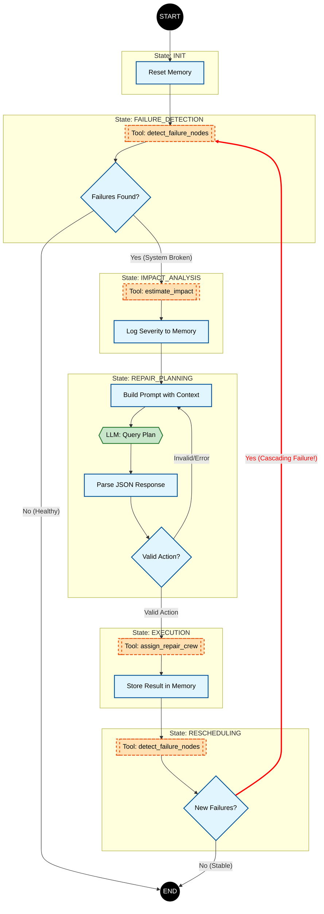

## Conceptual

### Agent

The agent is implemented as a finite state machine (FSM).

The FSM is triggered manually (e.g. by a metrics alert) and runs to completion. 

The states represent steps taken by the algorithm to:
- detect the issue
- plan for a solution
- assign resources to execute the plan
- validate the solution
- reschedule, if necessary to cover for cascading failures

### Flow

The FSM represents the following flow



## Setup

### Prerequisites

- Python 3.12 or higher
- [uv](https://docs.astral.sh/uv/) package manager

### Installing uv

#### Mac/Linux

```bash
# Install uv using the official installer
curl -LsSf https://astral.sh/uv/install.sh | sh
```

Alternatively, you can use Homebrew on macOS:

```bash
brew install uv
```

#### Windows

Using PowerShell:

```powershell
# Install uv using the official installer
powershell -c "irm https://astral.sh/uv/install.ps1 | iex"
```

Alternatively, you can use `pip`:

```powershell
pip install uv
```

### Project Setup

#### Mac/Linux

```bash
# Clone the repository (if not already done)
cd /path/to/project

# Create a virtual environment and install dependencies
uv sync

# Activate the virtual environment (this step might be redundant)
source .venv/bin/activate
```

#### Windows

```powershell
# Clone the repository (if not already done)
cd C:\path\to\project

# Create a virtual environment and install dependencies
uv sync

# Activate the virtual environment (this step might be redundant)
.venv\Scripts\activate
```

### Running the project

Once the virtual environment is activated, you can run the project:

#### Run the main application

```bash
uv run python -m infra_fail_mngr.main
```

#### Run all tests

```bash
uv run pytest
```

