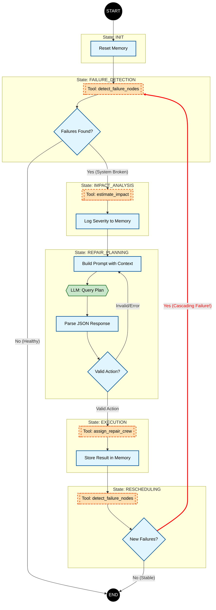
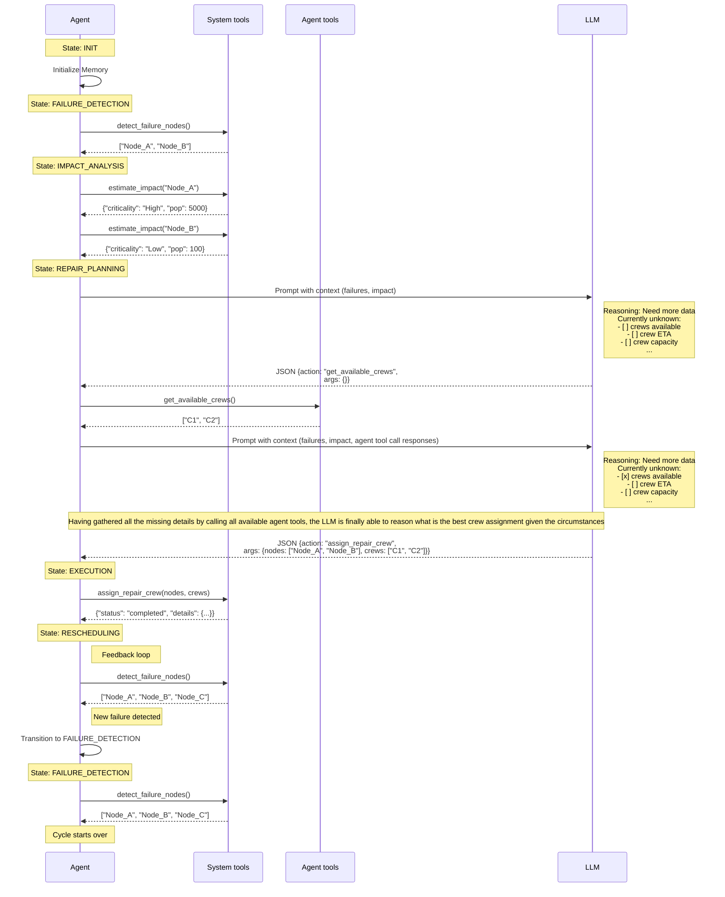

# Team Report

## Problem definition

The objective of this agent is the Infrastructure Failure Management.
The agent acts as a sole manager responsible for critical utility networks.
The goal perceived by the agentis to minimize the impact by detecting node failures, analysing their criticality (illustrated as "population affected") and assigning repair crews to deliver repairs.
The challenge lies in the non-deterministic automation: managing limited resources (crews), facing dynamic failures, potential cascading issues - requiring a balance of scripted monitoring and reasoning-based planning.

## Theoretical model

The tuple $\text{Agent} = \langle S, A, O, \pi \rangle$ expresses the theoretical model of our hybrid Finite State Machine (FSM) with an element of LLM reasoning.

### Components

#### States ($S$)

The system consists of these discrete states:

1. `INIT`: System initialization and memory reset.
2. `FAILURE_DETECTION`: Scans the network for broken nodes.
3. `IMPACT_ANALYSIS`: Calculates the cost/criticality of identified failures.
4. `REPAIR_PLANNING` ($\pi$): The policy (via LLM) decides the repair strategy.
5. `EXECUTION`: Deterministic application of the plan.
6. `RESCHEDULING`: Validates results and checks for cascading failures.
7. `FINAL`: Terminal state (either system is healthy or max steps reached).

#### Actions ($A$)

* Tool calls
  * Externally produced data 
* Transitions
  * Internal FSM logic that moves the agent across states

#### Observations ($O$)

Structured data returned by tools.

#### Policy ($\pi$)

The decision-making logic is hybrid:

* Deterministic
  * Used for monitoring and execution (while-loop hardcoded logic)
* Probabilistic (LLM)
  * Used specifically in the `REPAIR_PLANNING` state
  * The LLM receives the context ($S, O$) and the conversation history (context)
  * The LLM produces a JSON action plan ($A$)

### Flow

The state transitions follow the flow:

## Architecture implementation

### Hybrid architecture

The code implements a Finite State Machine pattern.
The `while` loop leverages the `self.state` to decide transitions.

The transition control flow is enforced in the code (not left for the LLM to decide).
The LLM is only invoked during the policy phase (`REPAIR_PLANNING` state).
This avoids wasting resources on deterministic state transitions, and only relies on the LLM reasoning while operating on observations received from tools.

After execution, the agent re-scans the environment, while in the `RESCHEDULING` state.
If new failures are detected (Cascading Failure), the FSM transitions back to `FAILURE_DETECTION` instead of terminating, allowing for continuous problem-solving.

### Agent loop

#### Tools (actions)

While the FMS is in the `REPAIR PLANNING` state, the LLM is provided with a list of tools available to it.
The LLM is instructed to call these tools to gather observations to help it drive the decision.

We separated the tools that are used internally by the agent (`system_tools`), only allowing the LLM to access the ones that are explicitly exposed to it (`agent_tools`).

| Tool name                    | Type   | Description                                     |
|------------------------------|--------|-------------------------------------------------|
| get_failed_nodes | system | Returns a list of broken nodes. |
| get_node_details | system | Returns details for a node.                             |
| assign_crew | system | Terminal action - assign a crew to repair a node | 
| get_weather_at_location | agent  | Returns weather for a location                  |
| get_available_crews | agent  | Returns a list of available crews               |
| get_crew_location | agent  | Returns the location of a crew                  |
| get_crew_remaining_capacity | agent  | Returns the remaining capacity of a crew        |
| estimate_repair_time | agent  | Returns an estimated repair time for a crew     |
| estimate_arrival_time | agent  | Returns an estimated arrival time for a crew    |

The `system` tools are essential to the FSM logic to be able to transition states.
Only the final state tool (`assign_crew`) is exposed to the LLM.
This could be removed as well (to be replaced by a terminal reasoning state), but seemed like a reasonable simplification.

The `agent` tools are completely imaginary: it seems reasonable to assume the output of these to require a non-deterministic reasoning - that's how these are made available to the LLM.

#### Challenges implementing the FSM

Decoupling and separation of concerns (to drive testability and concurrent work) were key considerations.
No challenges really.
We had the flow diagram done before writing the code, that's how the implementation followed the specification.

[TODO] Complete this section with the opinions of the team members.

### Context management

To copmly with the "Stateless LLM" constraint and token limits, we implemented a "Sliding window" mechanism.

The code maintains a `memory` (failures, plans, results) throughout the session.
When querying the LLM, we slice the `plan_history` list to the last `N` steps (`max_history_size = 5`).
This helps the LLM receive sufficient context not risking overflowing the context window.

### Data mocking and testing

The architecture is decoupled using the Repository Pattern (`SystemRepository`, `AgentRepository`).
This is done to improve testability - the skeleton of the code is fully covered by unit tests.

For the sake of meeting the exercise requirements, we introduced end-to-end tests where data is mocked for each individual case.

### LLM interaction

LLM is requested to respond with a JSON payload of a specific structure.
The system prompts inject a specific JSON schema and the Python controller parses this response.
If parsing fails, the error is logged to memory and submitted back to the LLM, hoping it will return a better response next time (no guarantee).

Prompt Structure & Decision Making
The system uses a three-layer prompt assembly (prompt_formatting.py). The include_context() method injects JSON operational data such as failures and impact reports. include_response_format() defines a strict JSON schema with concrete examples for both information gathering and final assignments. include_tools() adds available tools with complete descriptions.
The state-aware prompting (system_prompts.py) provides different prompts for each agent phase through get_prompt_for_state(). Each state like REPAIR_PLANNING and EXECUTION has specialized instructions that help the LLM make context-aware decisions.

JSON Schema Enforcement
A strict schema is enforced: {"thoughts": "...", "action": "...", "arguments": {...}}. The schema is reinforced with concrete examples in the prompt showing both information gathering and final assignment patterns, improving LLM compliance.

LLM Service & Client
The dual-mode client (llm_client.py) operates differently in test vs. production. In test mode it returns empty string for deterministic testing, while in production mode it auto-generates default JSON responses to prevent system hangs.
The intelligent parsing (llm_service.py) includes _limit_context() which applies a sliding window (2000 characters) for context management. The service distinguishes test from production responses and returns string for agent.py or dict for tests accordingly.

Decision Process
The LLM follows progressive reasoning: first identify missing information, then call appropriate tools sequentially, and finally make assignments only when all data is collected. This creates checklist-driven decision making.
Error recovery logs JSON parsing failures to memory, creating a feedback loop for self-correction. Tool-aware decisions are enhanced with dynamic tool injection that includes signatures and documentation for better tool selection.

## Case study

[TODO] Describe an execution example with comments on log entries

## Conclusion

[TODO] What have we learned?

[TODO] What would we improve in the next version?
