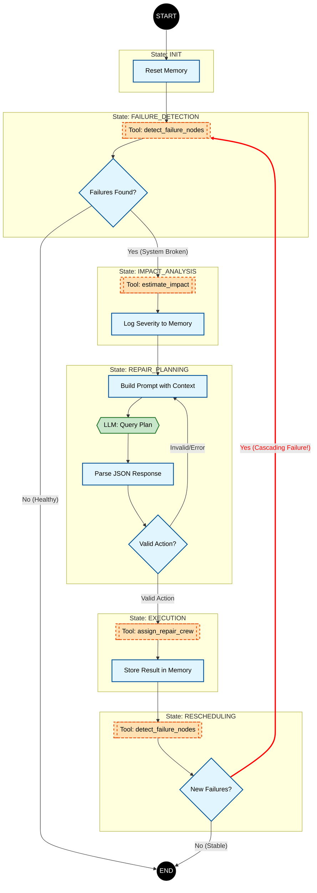

# Team Report

## Problem definition

The objective of this agent is the Infrastructure Failure Management.
The agent acts as a sole manager responsible for critical utility networks.
The goal perceived by the agentis to minimize the impact by detecting node failures, analysing their criticality (illustrated as "population affected") and assigning repair crews to deliver repairs.
The challenge lies in the non-deterministic automation: managing limited resources (crews), facing dynamic failures, potential cascading issues - requiring a balance of scripted monitoring and reasoning-based planning.

## Theoretical model

The tuple $\text{Agent} = \langle S, A, O, \pi \rangle$ expresses the theoretical model of our hybrid Finite State Machine (FSM) with an element of LLM reasoning.

### Components

#### States ($S$)

The system consists of these discrete states:

1. `INIT`: System initialization and memory reset.
2. `FAILURE_DETECTION`: Scans the network for broken nodes.
3. `IMPACT_ANALYSIS`: Calculates the cost/criticality of identified failures.
4. `REPAIR_PLANNING` ($\pi$): The policy (via LLM) decides the repair strategy.
5. `EXECUTION`: Deterministic application of the plan.
6. `RESCHEDULING`: Validates results and checks for cascading failures.
7. `FINAL`: Terminal state (either system is healthy or max steps reached).

#### Actions ($A$)

* Tool calls
  * Externally produced data 
* Transitions
  * Internal FSM logic that moves the agent across states

#### Observations ($O$)

Structured data returned by tools.

#### Policy ($\pi$)

The decision-making logic is hybrid:

* Deterministic
  * Used for monitoring and execution (while-loop hardcoded logic)
* Probabilistic (LLM)
  * Used specifically in the `REPAIR_PLANNING` state
  * The LLM receives the context ($S, O$) and the conversation history (context)
  * The LLM produces a JSON action plan ($A$)

### Flow

The state transitions follow the flow:

## Architecture implementation

### Hybrid architecture

The code implements a Finite State Machine pattern.
The `while` loop leverages the `self.state` to decide transitions.

The transition control flow is enforced in the code (not left for the LLM to decide).
The LLM is only invoked during the policy phase (`REPAIR_PLANNING` state).
This avoids wasting resources on deterministic state transitions, and only relies on the LLM reasoning while operating on observations received from tools.

After execution, the agent re-scans the environment, while in the `RESCHEDULING` state.
If new failures are detected (Cascading Failure), the FSM transitions back to `FAILURE_DETECTION` instead of terminating, allowing for continuous problem-solving.

### Agent loop

#### Tools (actions)

While the FMS is in the `REPAIR PLANNING` state, the LLM is provided with a list of tools available to it.
The LLM is instructed to call these tools to gather observations to help it drive the decision.

We separated the tools that are used internally by the agent (`system_tools`), only allowing the LLM to access the ones that are explicitly exposed to it (`agent_tools`).

| Tool name                    | Type   | Description                                     |
|------------------------------|--------|-------------------------------------------------|
| get_failed_nodes | system | Returns a list of broken nodes. |
| get_node_details | system | Returns details for a node.                             |
| assign_crew | system | Terminal action - assign a crew to repair a node | 
| get_weather_at_location | agent  | Returns weather for a location                  |
| is_holiday | agent | Returns whether the given date is a public holiday |
| is_weekend | agent | Returns whether the given date is Saturday or Sunday |
| get_time_of_day | agent | Returns a time-of-day category string for a given hour |
| estimate_travel_time | agent | Returns origin, destination, and estimated travel time |
| estimate_repair_time | agent | Returns node id and estimated repair time |
| crew_location | agent | Returns crew id and current location |
| is_crew_available | agent | Returns crew id and availability status |
| get_available_crews | agent | Returns a list of available crew ids |

The `system` tools are essential to the FSM logic to be able to transition states.
Only the final state tool (`assign_crew`) is exposed to the LLM.
This could be removed as well (to be replaced by a terminal reasoning state), but seemed like a reasonable simplification.

The `agent` tools are completely imaginary: it seems reasonable to assume the output of these to require a non-deterministic reasoning - that's how these are made available to the LLM.

#### Challenges implementing the FSM

Decoupling and separation of concerns (to drive testability and concurrent work) were key considerations.
No challenges really.
We had the flow diagram done before writing the code, that's how the implementation followed the specification.

### Context management

To copmly with the "Stateless LLM" constraint and token limits, we implemented a "Sliding window" mechanism.

The code maintains a `memory` (failures, plans, results) throughout the session.
When querying the LLM, we slice the `plan_history` list to the last `N` steps (`max_history_size = 5`).
This helps the LLM receive sufficient context not risking overflowing the context window.

### Data mocking and testing

The architecture is decoupled using the Repository Pattern (`SystemRepository`, `AgentRepository`).
This is done to improve testability - the skeleton of the code is fully covered by unit tests.

For the sake of meeting the exercise requirements, we introduced end-to-end tests where data is mocked for each individual case.

### LLM interaction

LLM is requested to respond with a JSON payload of a specific structure.
The system prompts inject a specific JSON schema and the Python controller parses this response.
If parsing fails, the error is logged to memory and submitted back to the LLM, hoping it will return a better response next time (no guarantee).

LLM Client
The LLM client defines the communication interface through the LLMClient protocol and its mock implementation in llm_client.py. Methods such as generate() return predefined or default JSON responses. In test mode, the client produces deterministic data to ensure predictable unit tests, while in production it synthesizes reasonable fallback actions. This design guarantees consistent performance in real-world scenarios and reliability during automated testing.

LLM Service
The LLMService in llm_service.py acts as the central controller with methods like 
handle_request() (prompt construction, LLM invocation, response processing) and 
_limit_context() (context management with sliding window). The service distinguishes 
test from production responses and returns Union[str, Dict] for compatibility. 
Invalid or empty responses trigger controlled errors.

Prompt Formatting 
The prompt_formatting.py module provides utility functions that assemble a unified, well-structured prompt. Functions like include_context(), include_response_format(), and include_tools() incorporate contextual information, enforce the strict JSON response schema, and list the available tools for the agent. This approach delivers comprehensive and unambiguous instructions to the LLM, preventing deviations, malformed JSON output, or incompatibilities with downstream components.

System Prompts
The system_prompts.py file contains specialized prompts for each crisis management 
phase through functions such as get_failure_detection_prompt(), 
get_repair_planning_prompt(), and get_execution_prompt(). Each prompt defines 
the LLM's role, objectives, decision-making rules, and available tools while 
confirming JSON schema compliance.

## Case study

For the system evaluation, we implemented 8 critical test scenarios covering the spectrum of potential failures in the FSM-LLM hybrid architecture. Each scenario tests specific functionalities and robustness:

test_invalid_json_from_llm: Tests resilience against formatting errors.

test_llm_missing_action_field: Tests processing of invalid responses.

test_unknown_tool_from_llm: Tests handling of unavailable actions.

test_assignment_failure_single_node: Tests retry logic under failed execution conditions.

test_partial_success_multi_node: Tests management of mixed results.

test_max_retries_exhaustion: Tests termination mechanisms.

test_large_number_of_failures_stress: Tests system's ability to maintain operability when facing multiple faults.

test_llm_timeout_raises: Tests handling of delays.

## Analysis of a Specific Execution Example with Log Commentary

Scenario: Partial Success at Multiple Failure Points (test_partial_success_multi_node)

STATE: INIT: System initialization, health check (all components load correctly).

STATE: FAILURE_DETECTION
[SYSTEM] Detected: ['node1', 'node2']: The FSM transitions to the detection state. The internal get_failed_nodes tool identifies both failures. Successful operation - deterministic check works as expected.

STATE: IMPACT_ANALYSIS: Criticality analysis. Details for each node (population, location, etc.) would be collected here. The logs do not show data collection, likely due to test configuration.

STATE: REPAIR_PLANNING
[LLM DECISION] assign_repair_crew with {'node_ids': ['node1', 'node2'], 'crew_ids': ['crew1', 'crew2']}: Critical failure point. The LLM makes a decision to assign both crews simultaneously. Identified issues are the lack of prioritization and absence of strategy.

STATE: EXECUTION
[EXECUTION] Dispatching Crews: {'node_ids': ['node1', 'node2'], 'crew_ids': ['crew1', 'crew2']}
[EXECUTION] Some assignments failed: ['node2']: Mixed execution. The system reports success for crew1 → node1 and failure for crew2 → node2.

STATE: REPAIR_PLANNING
[LLM DECISION] assign_repair_crew with {'node_ids': ['node1', 'node2'], 'crew_ids': ['crew1', 'crew2']}: Main system failure point. The agent returns to planning, but loses the successful assignment by requesting re-assignment of crew1 to node1. It fails to provide failure information to the LLM; therefore, the LLM is unaware that node2 has a prior failure and repeats the same decision without new context, producing the same output.

STATE: EXECUTION
[EXECUTION] Dispatching Crews: {'node_ids': ['node1', 'node2'], 'crew_ids': ['crew1', 'crew2']}
[EXECUTION] Some assignments failed: ['node2']: Infinite loop, meaning it repeats the same error and the system would continue requesting the same assignment indefinitely.

## Conclusion

The Hybrid Architecture (FSM + LLM) operates effectively by combining the Finite State Machine, which provides structure and predictability—ensuring processes execute reliably—with the LLM, which offers flexibility in decision-making for complex situations, preventing resource waste and unpredictable behavior.

Based on this, Context Management proved crucial for LLM performance, with the implementation of a sliding window mechanism. However, their instability necessitated an external memory and history management system for correct decision-making across multiple iterations.

Similarly, designing for testability accelerated development. Using design patterns combined with dependency isolation allowed for the creation of fast and reliable testing environments. Furthermore, end-to-end tests revealed issues in the overall flow and robustness that unit tests were unable to identify.

Error checking and handling form the core of system reliability. Given that LLMs are not inherently reliable, implementing robust validation mechanisms and automatic retries was essential. Moreover, the lack of a feedback mechanism between execution and planning phases led to infinite retry loops, particularly in partial failure scenarios.

Finally, the architectural decision-making affects scalability. The system demonstrated the ability to handle up to 50 concurrent faults. However, the sequential nature of the FSM, combined with the lack of parallel processing, presents a potential bottleneck in real-world scenarios with hundreds of simultaneous events.

In a version 2.0, we would improve by:

First, enhancing robustness through a smart multi-level fallback mechanism and improved error logging. Then, extending the state model and creating a "deep memory" for failure history. Subsequently, evolving the architecture towards a multi-agent and asynchronous structure for better scalability. Next, integrating optimization algorithms and simulation mechanisms for improved decision-making. Finally, developing comprehensive tools for monitoring, debugging, and auto-tuning for better operation and maintenance in a production environment.
